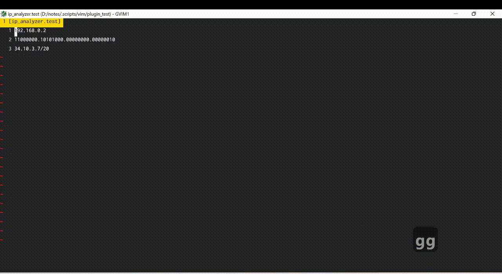

# Feature

#### Demo


# Installation
## Pathogen

Clone this repo to your plugin folder (usually in $HOME/.vim/bundle/)

#### Install Dependencies
1. Install python
2. Install pip
    ```
    python -m pip install --upgrade pip 
    ```
3. Install pipenv (we use virtual environment, so it won't conflict with other plugin / your python project)
    ```
    pip install pipenv
    ```
4. Go to this plugin folder (usually in `$HOME/.vim/bundle/ip-analyzer.vim/`)
5. Install the dependencies
    ```
    pipenv install -r requirements.txt 
    ```
6. Run install script, this will generate vim config, containing python path in virtual environment
    ```
    pipenv run python install.py
    ```
